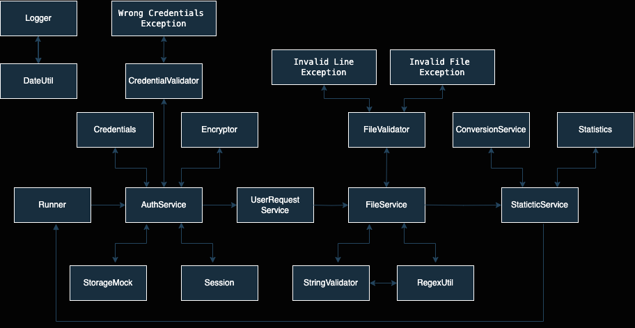
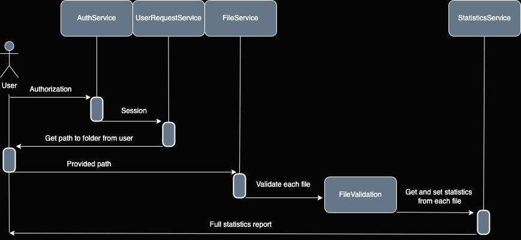

# TeachMeSkills: Final assignment

## Application: Payment Document Processing

### Content
[1 Objective](#objective)  
[2 Overview](#overview)  
[3 Sequence diagram](#sequence-diagram)  
[4 UML diagram](#uml-diagram)    
[5 App content](#app-content)  

### <a id="objective">1 Objective</a>

Application allows to process payment documents and generate financial reports.  
It enables user authentication, input of the path to financial documents, reads information from these documents,  
and compiles statistics.  
The program segregates documents into three types:   
    - `invoices`   
    - `orders`    
    - `receipts`  
all in `.txt` format. Application processes files from the current year.
---

### <a id="overview">2 Overview</a>

1. `User Authentication`: Users are prompted to enter their credentials (username and password) to access the program.
2. `Directory Input`: Users input the directory path containing financial documents for processing.
3. `Document Processing`: The program reads and processes documents within the specified directory,  
categorizing them into invoices, orders, and receipts based on their structure and naming conventions.
4. `Statistics Compilation`: After processing, the program compiles statistics including:
   - Total amount for `invoices`
   - Total amount for `orders`
   - Total amount for `receipts`
   - `Total amount for the year`
5. `Logging`: The program logs activities into separate files: one for general information and another for error  
information. It also logs the results of processing, including any invalid files encountered during execution.
Handling Invalid Files: Invalid files are moved to a separate directory after processing.
Final Report Generation: The final statistics are saved into a designated file for reference.
---

### <a id="sequence-diagram">3 Sequence diagram</a>

---

### <a id="uml-diagram">4 UML diagram</a>

---

### <a id="app-content">5 App content</a>

#### Application contains:

1. Interfaces: `ConversionConstants, EncryptorConstants, FileConstants, ErrorMessages, LogMessages, RegexConstants and  
   StatisticsMessages`. All interfaces are created to keeping constants for logger messages and file processing.
2. Class `Encryptor` processing encrypting (plus salt) and decrypting methods (minus salt) for user credentials.
3. Classes `InvalidFileException, InvalidLineException, WrongCredentialsException` are exception classes.  
Using by validators.
4. Class `Session` keeps information about the user session: expiration time and access token.
5. Class `StorageMock` keeps encrypted login and password values.
6. `util` package includes:
   - Record `Credential`. Contains `login` and `password` values. 
   - Class `DateUtil` generate current date and time for `Logger`.
   - Class `Logger` logs activities into separate files and console also.
   - Class `RegexUtil` allows to get line with total amount and total amount.
   - Class `Statistics` has private static values which include amount information. Access to information is implemented 
via getters and setters.  
7. `validation` package includes:
    - Class `CredentialValidator` define credentials validity.
    - Class `FileValidator` define file validity.
    - Class `StringValidator` define string validity.
8. Class `Runner` start application and process next logic: [1 Objective](#objective)